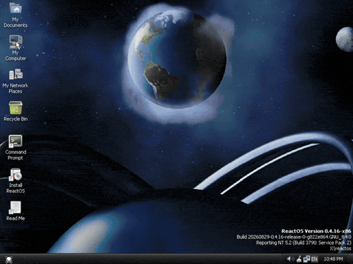
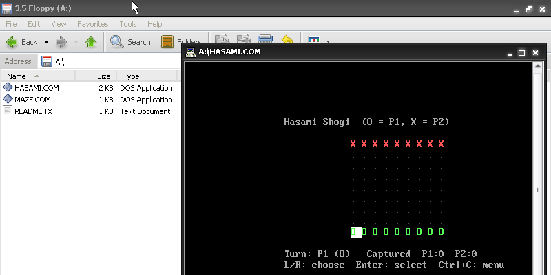

# maze_file.floppy - Boot Maze. Walk to your files.

English | [日本語 (Japanese)](README.ja.md)



When you boot the disk, you get a **maze-based file explorer**. Every file in the root directory appears as a numbered goal in a randomly generated maze. Walk to a number to open that file:

- `.COM` files are loaded and run as DOS-style programs.
- Other files are shown in a scrollable text viewer.

The image is a valid FAT12 volume, so you can mount it on Windows, macOS, or Linux and add, rename, or edit files. The changes show up the next time you boot.

This is my entry for the [1.44MB GAME_DEV CONTEST](https://2pgarcade.com/contest-144mb.html).

## Bundled programs

| File         | Description                  |
| ------------ | ---------------------------- |
| `MAZE.COM`   | A small maze game            |
| `HASAMI.COM` | Hasami Shogi for two players |

### Running the programs on Windows

The bundled `.COM` files also run directly on Windows, without booting the disk. You need a version of Windows that can still run 16-bit DOS programs, such as Windows XP or another 32-bit edition. 64-bit Windows cannot run them.

- If Windows is set to a non-English language, the programs fail with an error. Switch the language to English first.
- They also run on [ReactOS](https://reactos.org/).



## Requirements

- [NASM](https://www.nasm.us/)
- [GNU Make](https://www.gnu.org/software/make/)
- [QEMU](https://www.qemu.org/) or [Bochs](https://bochs.sourceforge.io/) to run it on a simulator (optional)

The repository includes a Dev Container (`.devcontainer/`) that installs all of these.

On Debian/Ubuntu you can install them with:

```sh
sudo apt install nasm make qemu-system-x86 qemu-system-gui bochs-x
```

## Build and run

```sh
make       # build build/floppy.img
make qemu  # boot the image in QEMU
make debug # boot the image in Bochs with its debugger
make clean # remove build outputs
```

You can also boot `build/floppy.img` in any emulator that supports a 1.44 MB floppy.

### Running on real hardware

Write `build/floppy.img` to a 1.44 MB floppy disk, then boot the PC from the floppy drive. The PC must boot with a legacy BIOS (see [Limitations](#limitations)).

Writing the image erases everything on the floppy disk.

**Linux**

If the floppy drive is `/dev/fd0`:

```sh
sudo dd if=build/floppy.img of=/dev/fd0 bs=512 conv=fsync
```

**Windows**

Windows has no built-in command for this. Use any tool that can write a raw disk image to a floppy disk.

## Controls

`Ctrl+C` returns to the menu from anywhere except the file explorer.

**File explorer (maze)**

| Key           | Action                                   |
| ------------- | ---------------------------------------- |
| ↑ / ↓ / ← / → | Move                                     |
| `N` / `P`     | Next / previous page (more than 8 items) |
| `F1`          | Open `README.TXT`                        |

**Text viewer**

| Key   | Action |
| ----- | ------ |
| ↑ / ↓ | Scroll |

**Hasami Shogi**

On each turn, use these keys in order:

| Step | Key           | Action                                                     |
| ---- | ------------- | ---------------------------------------------------------- |
| 1    | ← / →         | Cycle through your pieces                                  |
| 2    | `Enter`       | Select the piece. Squares it can move to are highlighted.  |
| 3    | ↑ / ↓ / ← / → | Move the cursor to a highlighted square                    |
| 4    | `Enter`       | Move there. Press `Enter` on the selected piece to cancel. |

## Limitations

- The disk boots only with a legacy BIOS. It does not boot on UEFI-only machines. On UEFI firmware, enable CSM (legacy boot) if it is available.
- Only the root directory is supported. Folders show a "not supported" message.
- Do not delete `README.TXT`. If you do, F1 help stops working.
- The text viewer shows at most the first 2 KiB or 200 lines of a file, whichever comes first. Long lines are wrapped, and each wrapped part counts as a line.
- Shutdown works only on QEMU, Bochs, and VirtualBox.

### Supported system calls

There is no DOS. A `.COM` program runs in real mode and can use these interrupts:

| Interrupt           | Behavior                                                    |
| ------------------- | ----------------------------------------------------------- |
| `int 0x20`          | Exit and return to the menu                                 |
| `int 0x21`          | Exit and return to the menu, **whatever the value of `AH`** |
| BIOS                | Available as usual                                          |

Because every `int 0x21` call exits, DOS functions don't work. Use BIOS calls directly instead.

## Adding a program

You can copy a `.COM` file onto the mounted image. It shows up in the maze the next time you boot. The program must follow the limits in [Supported system calls](#supported-system-calls).
